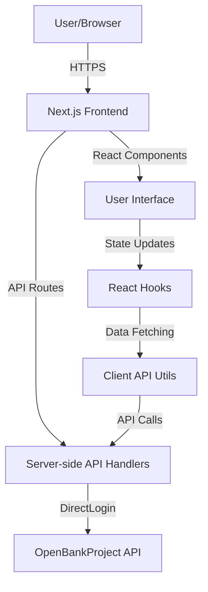
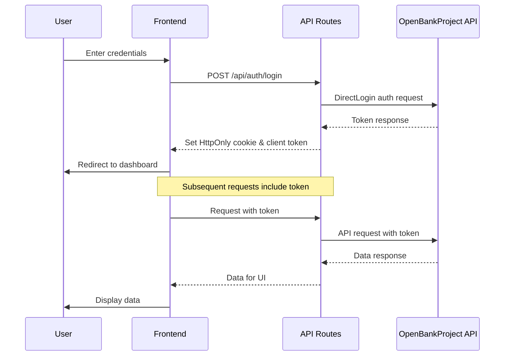

# Developer Guide - Open Banking Dashboard

This guide provides comprehensive information for developers working with the Open Banking Dashboard application. Whether you're looking to contribute, customize, or understand the codebase, this document will help you navigate the technical aspects of the project.

## Table of Contents

- [Developer Guide - Open Banking Dashboard](#developer-guide---open-banking-dashboard)
  - [Table of Contents](#table-of-contents)
  - [Architecture Overview](#architecture-overview)
  - [Code Structure](#code-structure)
  - [Environment Setup](#environment-setup)
    - [Prerequisites](#prerequisites)
    - [Development Setup](#development-setup)
  - [Authentication System](#authentication-system)
    - [Authentication Flow](#authentication-flow)
  - [API Integration](#api-integration)
    - [Key API Endpoints:](#key-api-endpoints)
  - [State Management](#state-management)
  - [UI Components](#ui-components)
  - [Testing](#testing)
  - [Extending the Application](#extending-the-application)
    - [Adding New Features](#adding-new-features)
    - [Customizing the Theme](#customizing-the-theme)
    - [Implementing New API Integrations](#implementing-new-api-integrations)
  - [Troubleshooting Common Issues](#troubleshooting-common-issues)
    - [Authentication Problems](#authentication-problems)
    - [API Integration Issues](#api-integration-issues)
    - [UI Rendering Problems](#ui-rendering-problems)
  - [Best Practices](#best-practices)

## Architecture Overview

The Open Banking Dashboard uses Next.js as its foundation, providing server-side rendering, API routes, and a modern React frontend. Here's the high-level architecture:



The application follows a layered architecture:

1. **UI Layer**: React components in `/components` directory
2. **Application Layer**: Hooks and services in `/hooks` and `/lib` directories
3. **API Layer**: Next.js API routes in `/app/api` directory
4. **Integration Layer**: Direct communication with OpenBankProject API via services in `/lib/banking`

## Code Structure

The codebase is organized into the following main directories:

- `/app`: Next.js application routes and pages
  - `/api`: Backend API routes that communicate with the OpenBankProject API
  - `/dashboard`, `/login`, etc.: Frontend page routes
- `/components`: Reusable UI components
  - `/kokonutui`: Application-specific components
  - `/ui`: Generic UI components (based on shadcn/ui)
- `/hooks`: React hooks for state management and business logic
- `/lib`: Utilities, services, and helpers
  - `/banking`: OpenBankProject API integration code
  - `/users`: User management functionality
- `/public`: Static assets
- `/styles`: Global CSS files
- `/scripts`: Utility scripts for testing and development

## Environment Setup

### Prerequisites

- Node.js 18+ and npm
- Access to OpenBankProject API (consumer key)

### Development Setup

1. Clone the repository
2. Install dependencies with `npm install`
3. Create a `.env.local` file with the necessary environment variables:

```
# Client-side API configuration
NEXT_PUBLIC_API_BASE_URL=http://localhost:3000/api

# Server-side API configuration
API_BASE_URL=https://apisandbox.openbankproject.com
OBP_API_VERSION=v5.0.0
OBP_CONSUMER_KEY=your_consumer_key_here
OBP_DIRECT_LOGIN_URL=https://apisandbox.openbankproject.com/my/logins/direct
```

4. Start the development server with `npm run dev`
5. Open http://localhost:3000 in your browser

## Authentication System

The application uses OpenBankProject's DirectLogin authentication method. The implementation is primarily in:

- `lib/banking/direct-login-client.ts`: Core authentication logic
- `app/api/auth/login/route.ts`: Server-side login endpoint
- `app/api/auth/register/route.ts`: User registration
- `hooks/use-banking-data.ts`: Client-side authentication handling

### Authentication Flow



The system uses both HttpOnly cookies (for security) and client-side tokens (for state management). Token refresh and validation logic is built into the DirectLoginClient class.

## API Integration

The application integrates with the OpenBankProject API through several layers:

1. **DirectLoginClient** (`lib/banking/direct-login-client.ts`): Handles authentication and raw API requests
2. **API Routes** (`app/api/*`): Server-side endpoints that proxy requests to OpenBankProject
3. **Client API Utilities** (`lib/open-banking-api.ts`): Frontend utilities for making API requests

### Key API Endpoints:

- `app/api/auth/login`: User authentication
- `app/api/auth/register`: User registration and account creation
- `app/api/banks`: Get available banks
- `app/api/accounts/[bankId]`: Get accounts for a specific bank
- `app/api/transactions/[bankId]/[accountId]/[viewId]`: Get transactions for an account
- `app/api/accounts/[bankId]/send`: Transfer money between accounts
- `app/api/accounts/[bankId]/topup`: Add funds to an account

## State Management

The application uses React hooks for state management instead of a global state library. The main state management is implemented in:

- `hooks/use-banking-data.ts`: Core hook that manages authentication, accounts, and transactions

This hook provides:

- Authentication state
- Account and transaction data
- Data fetching and refresh functionality
- Transfer and top-up operations

Usage example:

```jsx
const {
  accounts,
  transactions,
  isAuthenticated,
  login,
  logout,
  sendMoney,
} = useBankingData();
```

## UI Components

The UI is built using a combination of custom components and shadcn/ui components:

- `/components/ui`: Base UI components (derived from shadcn/ui)
- `/components/kokonutui`: Application-specific components

Key components:

- `login-form.tsx`: User authentication form
- `dashboard.tsx`: Main dashboard layout and data display
- `open-account-modal.tsx`: Account creation interface
- `transaction-details-modal.tsx`: Transaction details view

The application supports both light and dark themes using Next.js themes.

## Testing

Test scripts are located in the `/scripts` directory. These scripts help validate various aspects of the application:

- `test-banks-api.js`: Tests the banks API endpoints
- `test-curl.js`: Simulates curl requests for API testing
- `test-full-flow.js`: Tests the full user flow from login to transaction viewing
- `test-register-fix.js`: Tests user registration functionality
- `verify-server-api-fix.js`: Validates server API fixes

To run tests:

```
node scripts/test-full-flow.js
```

## Extending the Application

### Adding New Features

1. **New API Endpoint**:

   - Create a new file in `/app/api/[feature]/route.ts`
   - Implement the necessary HTTP methods (GET, POST, etc.)
   - Add authentication checks using the existing mechanisms

2. **New UI Component**:

   - Create a new component in `/components/kokonutui/[component-name].tsx`
   - Use existing UI components from `/components/ui`
   - Integrate with the banking data hook if needed

3. **New Page**:
   - Create a new page in `/app/[page-name]/page.tsx`
   - Use the existing layout and components
   - Connect to the data layer using hooks

### Customizing the Theme

The application uses Tailwind CSS for styling. To customize the theme:

1. Modify the `tailwind.config.js` file to change colors, fonts, etc.
2. Update the dark/light mode configurations in the theme provider

### Implementing New API Integrations

To integrate with additional banking APIs:

1. Create a new client implementation similar to `direct-login-client.ts`
2. Update the API routes to use the new client when appropriate
3. Modify the data transformers to handle the new API's response format

## Troubleshooting Common Issues

### Authentication Problems

- Check that the OBP_CONSUMER_KEY is valid
- Verify that cookies are being correctly set and sent
- Use the test scripts to validate the authentication flow

### API Integration Issues

- Check the browser console and server logs for error messages
- Verify that the API endpoints are correctly configured
- Ensure the API response transformers handle all possible formats

### UI Rendering Problems

- Verify that the data structure matches what components expect
- Check for React key warnings in the console
- Test with both light and dark themes to ensure proper styling

## Best Practices

- Follow the existing code style and organization
- Add comments for complex logic
- Use TypeScript interfaces for API responses
- Implement proper error handling at all levels
- Use the tracing utilities for logging
- Keep components small and focused on a single responsibility
- Maintain separation between UI, business logic, and API integration
