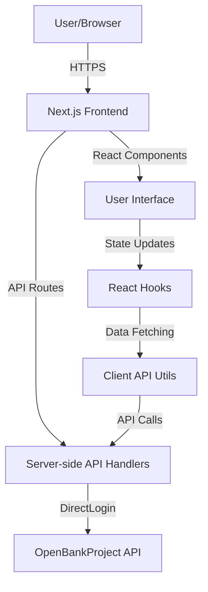
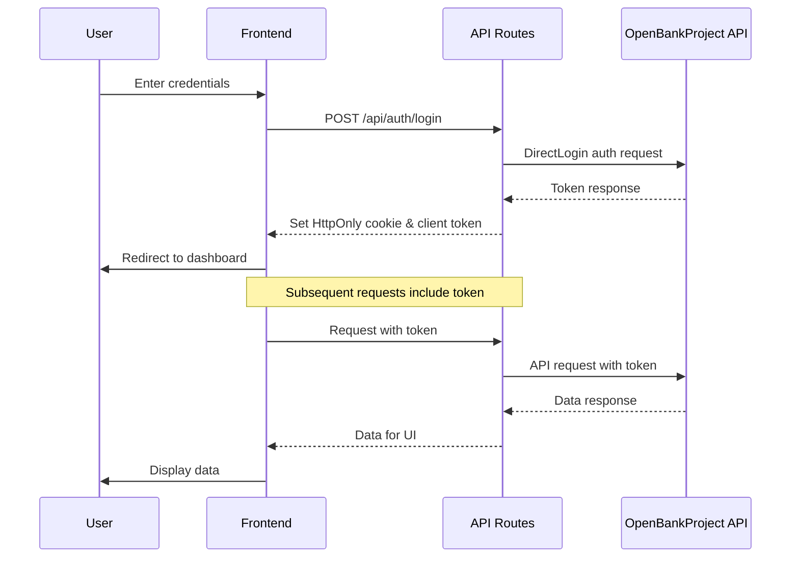
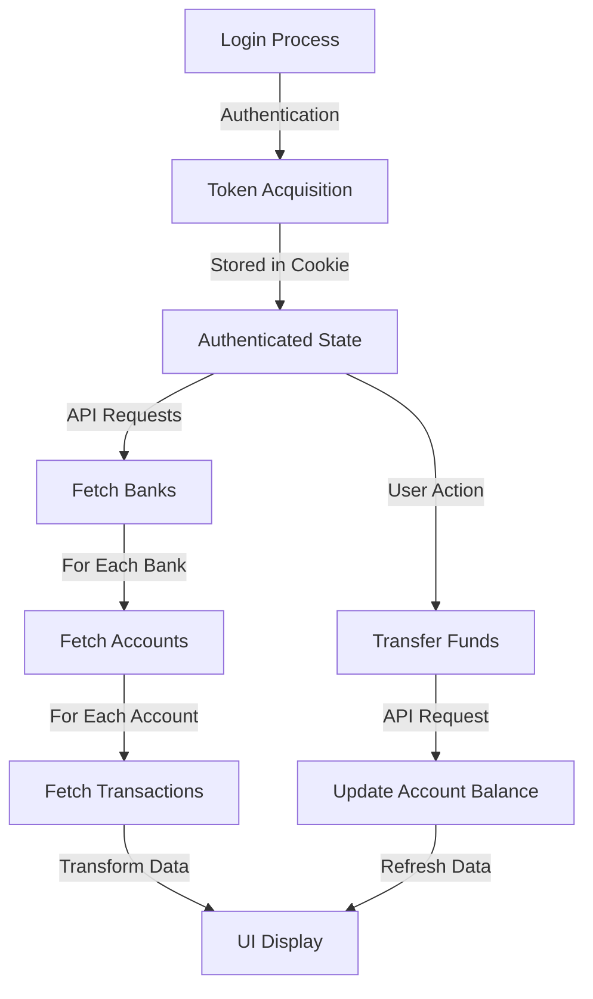
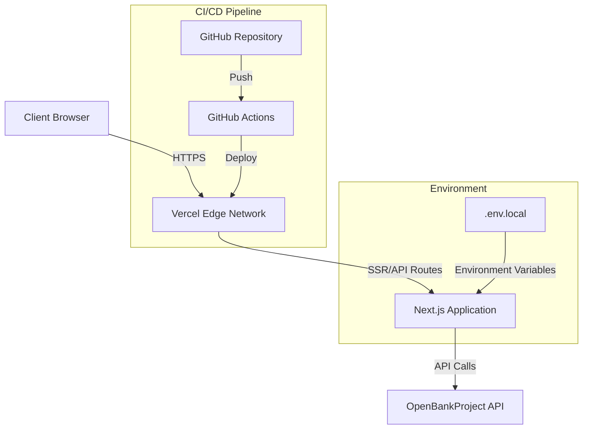

# Open Banking Dashboard - Documentation Plan

This document outlines the comprehensive documentation plan for the Open Banking Dashboard application, covering developer, user, and operational aspects.

## 1. Project Overview and Structure

### 1.1 Introduction

- Project purpose and goals
- Key features and capabilities
- Target audience and use cases

### 1.2 Architecture Overview

- High-level system architecture
- Component interaction diagram
- Data flow diagram
- Authentication flow diagram

### 1.3 Technology Stack

- Frontend: Next.js, React, Tailwind CSS
- UI Components: Kokonut UI component library
- API Integration: OpenBankProject API
- Authentication: DirectLogin
- State Management: React Hooks and Context
- Styling: Tailwind CSS with theming

## 2. Developer Documentation

### 2.1 Getting Started

- Prerequisites (Node.js 18+, npm)
- Repository structure
- Environment setup
- Setting up API keys and consumer keys
- Development workflow

### 2.2 Authentication System

- DirectLogin implementation details
- Token management
- Session handling
- Cookie security mechanisms

### 2.3 API Integration

- OpenBankProject API overview
- API client implementation
- Error handling strategies
- Mock data implementation for development

### 2.4 Key Components

- Core components and their purpose
- Component hierarchy
- State management approach
- Data fetching patterns

### 2.5 Customization

- Theming and styling
- Adding new features
- Extending API integrations
- Configuration options

### 2.6 Testing

- Testing strategy
- Test scripts overview
- Writing new tests
- CI/CD integration

### 2.7 Code Style and Conventions

- TypeScript guidelines
- Component structure
- Naming conventions
- Error handling patterns

## 3. User Documentation

### 3.1 Getting Started

- Application overview
- Account creation process
- Login process
- Dashboard navigation

### 3.2 Account Management

- Viewing account information
- Managing multiple accounts
- Understanding account types
- Security features

### 3.3 Transactions

- Viewing transaction history
- Filtering and searching transactions
- Transaction details
- Export options

### 3.4 Making Transfers

- Transfer between accounts
- Top-up functionality
- Transfer limits and security
- Confirmation process

### 3.5 Security Features

- Security best practices
- Password protection
- Session management
- Data privacy

## 4. Operations/DevOps Documentation

### 4.1 Deployment Guide

- Production setup requirements
- Environment configuration
- Deployment options (Vercel, custom server)
- CI/CD pipeline setup

### 4.2 Infrastructure

- Server requirements
- Database requirements (if applicable)
- Scaling considerations
- Performance optimization

### 4.3 Monitoring and Logging

- Tracing implementation
- Log management
- Error tracking
- Performance monitoring

### 4.4 Security Operations

- API key management
- Environment variable security
- Cookie security configuration
- HTTPS setup

### 4.5 Backup and Recovery

- Data backup strategies
- Recovery procedures
- Disaster recovery planning
- Failover mechanisms

### 4.6 Maintenance

- Update procedures
- Dependency management
- Database maintenance (if applicable)
- Performance tuning

## 5. API Reference

### 5.1 Authentication APIs

- Login API
- Registration API
- Logout API
- Token validation

### 5.2 Account APIs

- List accounts
- Account details
- Create account
- Account transactions

### 5.3 Transaction APIs

- List transactions
- Transaction details
- Filter transactions
- Transaction metadata

### 5.4 Bank APIs

- List banks
- Bank details
- Available features

## 6. Appendices

### 6.1 Troubleshooting

- Common issues and solutions
- Debugging techniques
- Support resources

### 6.2 Glossary

- Banking terminology
- Technical terms
- Abbreviations

### 6.3 Resources

- External documentation links
- OpenBankProject API documentation
- Community resources

## 7. Diagrams

### 7.1 System Architecture Diagram

### 7.2 Authentication Flow Diagram

### 7.3 Data Flow Diagram

### 7.4 Deployment Architecture

